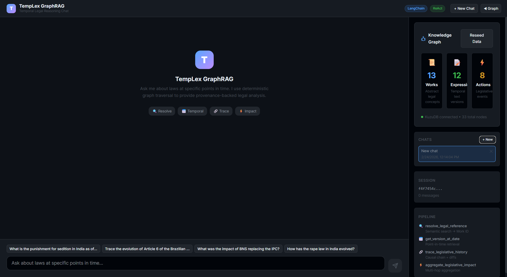

# TempLex GraphRAG

**Deterministic, CPU-Optimized Temporal Legal Reasoning Agent**

A full-stack implementation of the SAT-Graph RAG framework with an LRMoo-inspired ontology, embedded KuzuDB graph database, and zero-cost LLM orchestration.

## Architecture

```
User Query → LLM Query Planner (Gemini Flash)
           → DAG of Canonical Actions
           → resolveItemReference (Probabilistic: Vector Search)
           → getValidVersion (Deterministic: Temporal Traversal)
           → traceCausality (Deterministic: Causal Edge Walk + Diff)
           → aggregateImpact (Deterministic: Multi-hop Aggregation)
           → fetchLiveCases (JIT Retrieval: API to Graph Ingestion)
           → LLM Response Synthesizer
           → Provenance-Backed Legal Analysis
```

### Just-In-Time (JIT) Retrieval
TempLex features a JIT Retrieval pipeline for fetching live data on the fly:
1. **Dynamic Fetching**: If the local graph lacks recent or specific cases, the LLM uses `fetch_live_cases_tool` to search the live CourtListener API.
2. **Parallel Processing**: Fetches multiple court opinions concurrently using multithreading to minimize latency.
3. **Native Graph Ingestion**: Downloaded text is instantly embedded (using `all-MiniLM-L6-v2`) and woven into the KuzuDB graph using the LRMoo schema (Work, Expression, and Action nodes).
4. **Seamless RAG**: Once natively ingested, the LLM is forced to re-query the deterministic local graph to safely read the new cases, strictly preventing hallucinations.

## UI Preview

Main chat interface (TempLex GraphRAG):



## Tech Stack

| Layer        | Technology                       | Role                                  |
| ------------ | -------------------------------- | ------------------------------------- |
| Graph DB     | KuzuDB (C++, in-process)         | LRMoo ontology, disk-backed traversal |
| Embeddings   | all-MiniLM-L6-v2                 | CPU-optimized 384-dim vectors         |
| Primary LLM  | Google Gemini Flash (free tier)  | Query planning + synthesis            |
| Fallback LLM | OpenRouter (free tier)           | Resilient multi-model routing         |
| API          | FastAPI                          | REST endpoints                        |
| Frontend     | Next.js + TypeScript             | GitHub-dark themed UI                 |
| Data         | CourtListener / Free Law Project | 9M+ legal decisions                   |

## Setup

### Prerequisites

- Python 3.11+
- Node.js 18+

### Backend

```bash
pip install -r requirements.txt
cp .env.example .env
# Edit .env to add your required API keys:
# - GEMINI_API_KEY (free from https://aistudio.google.com)
# - HF_TOKEN (Hugging Face token for the chat agent)
# - COURTLISTENER_API_TOKEN (free from Free Law Project for JIT retrieval)

# Load seed data
python main.py --seed

# Start API server
python main.py --serve
```

### Frontend

```bash
cd frontend
npm install
npm run dev
```

Open `http://localhost:3000` — the frontend connects to the FastAPI backend on `:8000`.

## Demo Queries

1. **Temporal retrieval (IPC→BNS):** "What is the punishment for sedition in India as of August 2024?"
2. **Causal tracing (Brazil):** "Trace the legislative lineage that introduced 'housing' in Article 6 of the Brazilian Constitution"
3. **Impact analysis:** "What was the systemic impact of the BNS replacing the IPC?"

## Case Studies

### IPC → BNS Transition (July 1, 2024)

The Indian Penal Code (1860) was entirely replaced by the Bharatiya Nyaya Sanhita (2023). TempLex tracks the wholesale code replacement with precise validity intervals, handling sedition repeal, rape law expansion, and organized crime incorporation.

### Brazilian Constitution Article 6

Traces 4 versions across 3 amendments (housing in 2000, food in 2010, transportation in 2015) with full causal provenance.

## License

MIT
